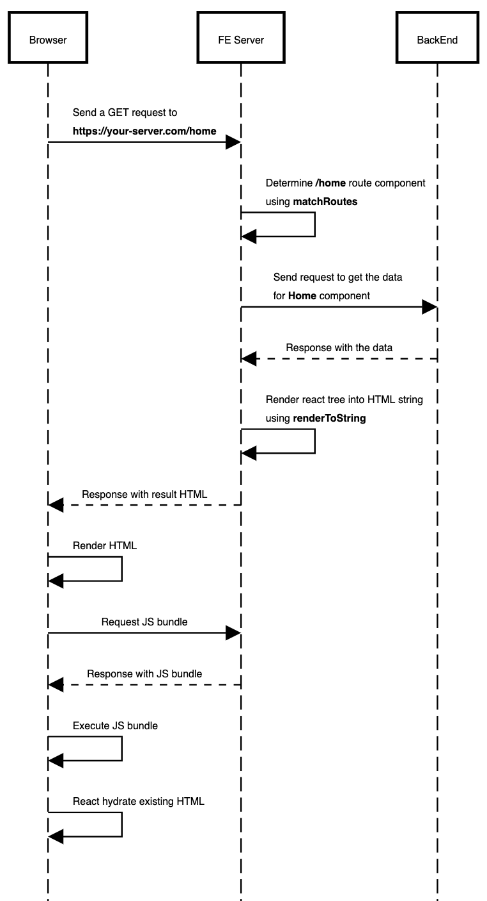

#FrontEnd #architecture #rendering

# Universal rendering in a nutshell

This article serves as a brief synopsis of existing techniques for rendering web applications, as well as a more detailed look at the implementation of universal apps.

## Rendering techniques

* Server side rendering (SSR)
* Client side rendering (CSR)
* Rehydration (Universal / Isomorphic rendering)
* Prerendering
* Static rendering

### Server side rendering

Server rendering generates the full HTML for a page on the server in response to navigation. This avoids additional round-trips for data fetching and templating on the client, since it’s handled before the browser gets a response. Generating HTML happens on-demand, as the user navigates to different urls [[1]](#ref-1).

### Client side rendering

Client-side rendering (CSR) means rendering pages directly in the browser using JavaScript. All logic, data fetching, templating and routing are handled on the client rather than the server [[1]](#ref-1).

### Rehydration

This approach attempts to smooth over the trade-offs between Client-Side Rendering and Server Rendering by doing both. Navigation requests like full page loads or reloads are handled by **a server** that renders the application to HTML, then the JavaScript and data used for rendering is embedded into the resulting document after that “picks up” by rendering again **on the client** using a technique called **(re)hydration** [[1]](#ref-1).

### Prerendering

Prerendering is a technique that you use **a renderer** to pre-render your CSR app and response ready-to-rendered viewable HTML output to page requests. The prerendering process can happen at build time, runtime or on schedule using local tools or remote services [[2]](#ref-2). This approach solves a known critical problem that CSR apps are not behave well on search engines (not SEO friendly).

There are several types of prerendering techique:
* Prerendering at build time;
* Prerendering on the fly;
* Prerendering on schedule.

### Static rendering

Static rendering happens at build time. Generally, static rendering means producing a separate HTML file for each URL. Static rendered pages are interactive without the need to execute much client-side javascript. This technique is not a choice for highly dynamic content. Every time your content changes you need to rebuild app.

## Understanding universal rendering

If you have ever used Next.js - then universal rendering is not new to you. This technique combines the both: SSR and CSR. In result application enhanced with a good SEO performance (thanks to SSR) and interactivity (thanks to CSR). Downside of this approach is more complex implementation than pure SSR or CSR.

Benefits

* Good SEO and social sharing;
* Fast time to meaningful content (To see page content browser needs only html. Data already presents on the rendered page);
* Partially works even if javascript is disabled.

Drawbacks

* Negative impact on Time to Interactive. Such pages often look deceptively loaded and interactive, but can’t actually respond to input until the client-side javascript is executed and event handlers have been attached;
* Since render process happens on the server it adds additional load on such server;
* Time consuming and hard to implement properly.

### Implementation and key challenges

While implementing universal rendering we should solve several challenges:
* Routing;
* Handling data fetch;
* State synchronisation;
* (Re)hydration.

We will use following stack to implement universal rendering from scratch: Express, React, React Router, Redux, Axios.

1. Routing

The main idea here is to share the same routes for both client and server. The **react-router** expose two types of router: **BrowserRouter** (for client side purposes) and **StaticRouter** (for server side purposes). On the server (for **StaticRouter**), we need to manually provide route path (using **location** prop) so router can render appropriate component that matches url. We use express, so we can provide **request.originalUrl** from express route handler as the value of **location** prop for **StaticRouter**.

[Code sample](https://github.com/ok2ju/react-ssr-example/blob/master/src/server/ssrMiddleware.js#L26)

2. Handling data fetch

To compose result html we will use **renderToString** method from **react-dom/server**. But the main point here is that **renderToString** method does not execute any lifecycle methods. The only methods of a React component executed are constructor and render. So, in result we would need to manually fetch the data for the components on the server itself before returning the HTML.

The first problem is that the desired component is buried inside the react tree (can be placed a far deep in react tree) and not accessible easily. Second, we could have hundreds of routes, so we can’t blindly fetch data for the desired component only.

To identify component rendered by **StaticRouter** we will use **matchRoutes** method of **react-router-config**. It runs the route matching algorithm for a set of routes against a given location to see which routes match. If it finds a match, an array of objects is returned, one for each route that matched.

The next step is to define our routes. We will define our routes as array of objects. If some component (route) should fetch data we add additional prop **loadData** to route declaration. Then as we mention before we know about component rendered by **StaticRouter** using **matchRoutes**. So we can run **loadData** for each matched route. In result we have data for our component before rendering.

[Code sample](https://github.com/ok2ju/react-ssr-example/blob/master/src/server/ssrMiddleware.js#L12-L20)

3. State synchronisation

So, we get required data for our components on server side but client side need this data as well (as initial state of redux store). To synchronise data between server and client we will store redux state in **window** object. So on the client side we can initialise redux store using this data from **window**.

[Code sample - save state into window object](https://github.com/ok2ju/react-ssr-example/blob/master/src/server/ssrMiddleware.js#L36)

[Code sample - initialise redux store using data from window object](https://github.com/ok2ju/react-ssr-example/blob/master/src/client/index.jsx#L9-L12)

4. (Re)hydration

A server renders the application to HTML, then the JavaScript and data used for rendering is embedded into the resulting document after that “picks up” by rendering again **on the client**. The process of utilising the html (on the client side) rendered by **ReactDOMServer** called **hydration**.

**Render** method of **react-dom** replaces the entire html tree by rendering components from scratch. So, we can use it. Instead we will use [hydrate](https://reactjs.org/docs/react-dom.html#hydrate) method of **react-dom**. It hydrate a container whose html were rendered on the server. React will attempt to attach event listeners to that html. The main point here is that react expects that the rendered content is identical between the server and the client. The mismatches can lead to unexpected results.

[Code sample](https://github.com/ok2ju/react-ssr-example/blob/master/src/client/index.jsx#L19)

Sequence diagram to illustrate whole flow:

## Wrapping up

* SSR is not suitable for any project;
* Implementing SSR properly is hard and time consuming;
* Always consider performance issues on server-side fetching;
* Don’t involve SSR technique at the beginning of the project since your project becomes complicated you could apply it whenever you need it;
* You don’t have to follow SSR on entire your application. You may setup SSR just for some particular routes to gain better performance on initial load or use prerendering.

## References

* [1] [“Rendering on the Web”](https://developers.google.com/web/updates/2019/02/rendering-on-the-web). Google Developers.
* [2] [“On the incompleteness of prerendering”](https://ageek.dev/prerendering). AGeek Dev
